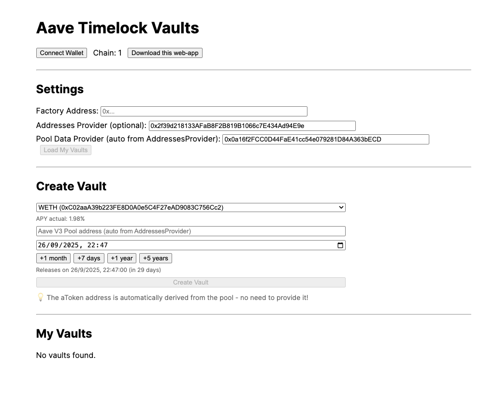

# 🏦 Aave Vault DApp

Una aplicación descentralizada completa para crear y gestionar vaults con timelock en Aave V3, incluyendo una aplicación de escritorio Electron.

## ✨ Características

### 🔒 Smart Contracts
- **VaultFactory**: Factory para crear vaults de Aave V3
- **TimelockAaveVault**: Vault con timelock para depósitos y retiros
- **Mock Contracts**: Contratos de prueba para desarrollo

### 🌐 Frontend Web
- **React 18** con TypeScript
- **Vite** para desarrollo rápido
- **UI moderna** y responsive
- **Integración con wallets**

### 🖥️ Aplicación Desktop
- **Electron** para aplicación nativa
- **Icono personalizado** con diseño profesional
- **Multiplataforma** (macOS, Windows, Linux)
- **Interfaz web integrada**

## 🚀 Instalación

### Prerrequisitos
- Node.js 18+
- npm o yarn
- Git

### Clonar el repositorio
```bash
git clone <tu-repositorio-url>
cd cursor-aave-vault
```

## 📦 Estructura del Proyecto

```
aave-vault-dapp/
├── contracts/          # Smart contracts y tests
│   ├── contracts/      # Contratos Solidity
│   ├── test/          # Tests con Hardhat
│   └── scripts/       # Scripts de deployment
├── frontend/           # Aplicación React
│   ├── src/           # Código fuente
│   └── dist/          # Build de producción
└── desktop/            # Aplicación Electron
    ├── assets/         # Iconos y recursos
    └── scripts/        # Scripts de build
```

## 🔧 Desarrollo

### Smart Contracts
```bash
cd aave-vault-dapp/contracts
npm install
npm run compile
npm run test
```

### Frontend Web
```bash
cd aave-vault-dapp/frontend
npm install
npm run dev
```

### Aplicación Desktop
```bash
cd aave-vault-dapp/desktop
npm install
npm run dev          # Desarrollo
npm run build        # Build de producción
```

## 🧪 Testing

### Tests de Smart Contracts
```bash
cd aave-vault-dapp/contracts
npm run test
npm run test:coverage
npm run test:gas
```

## 🏗️ Build

### Frontend
```bash
cd aave-vault-dapp/frontend
npm run build
```

### Desktop App
```bash
cd aave-vault-dapp/desktop
npm run build        # Build para todas las plataformas
npm run build:mac    # Solo macOS
npm run build:win    # Solo Windows
npm run build:linux  # Solo Linux
```

## 🎨 Iconos

El proyecto incluye un sistema de generación de iconos personalizado:

```bash
cd aave-vault-dapp/desktop
npm run generate-icons
```

### Icono Personalizado
- **Mano blanca** sosteniendo un candado
- **Letra "A"** prominente en el candado
- **Fondo degradado** púrpura a azul teal
- **Diseño moderno** y profesional

## 📱 Plataformas Soportadas

### Desktop
- ✅ macOS (ARM64, Intel)
- ✅ Windows (ARM64, x64)
- ✅ Linux (ARM64, x64)

### Web
- ✅ Chrome/Chromium
- ✅ Firefox
- ✅ Safari
- ✅ Edge

## 🔐 Seguridad

- **nodeIntegration: false** en Electron
- **Context isolation** habilitado
- **Web security** activado
- **Mock contracts** para testing seguro

## 📄 Licencia

MIT License - ver [LICENSE](LICENSE) para más detalles.

## 🤝 Contribuir

1. Fork el proyecto
2. Crea una rama para tu feature (`git checkout -b feature/AmazingFeature`)
3. Commit tus cambios (`git commit -m 'Add some AmazingFeature'`)
4. Push a la rama (`git push origin feature/AmazingFeature`)
5. Abre un Pull Request

## 📞 Contacto

- **Proyecto**: [Aave Vault DApp](https://github.com/tu-usuario/cursor-aave-vault)
- **Issues**: [GitHub Issues](https://github.com/tu-usuario/cursor-aave-vault/issues)

---

⭐ **¡Si te gusta este proyecto, dale una estrella!**
=======
# Aave Vault DApp

A minimal, client-only savings dApp with hard timelock vaults depositing into Aave V3. Create multiple independent vaults, deposit an ERC20 asset, accrue Aave yield, and prevent withdrawals until a chosen release time.

## Features
- Timelock vaults that deposit into Aave V3 and block withdrawals until `releaseTime`.
- Extend-only lock (can only increase `releaseTime`).
- Factory to create and index user vaults on-chain.
- Client-only React app (Vite) to create vaults, deposit, and withdraw (after time).
- No admin backdoors in vaults; non-upgradeable, immutable owner.
- **Automatic aToken detection** - no need to manually provide aToken addresses!
 
Test it here: https://pabloes.github.io/aave-vault-dapp/




## Monorepo Layout
- `contracts/` — Hardhat project with Solidity contracts and deploy scripts
- `frontend/` — Vite + React app

---

## 1) Contracts

### Prerequisites
- Node.js LTS
- pnpm (recommended) or npm

### Install
```bash
cd contracts
pnpm install
# or: npm install
```

### Configure Networks (optional)
Copy `.env.example` to `.env` and populate keys as needed.
```bash
cp .env.example .env
```

Supported networks are configured via Hardhat. You can add your RPCs and accounts in `.env`.

### Compile
```bash
pnpm hardhat compile
```

### Deploy Factory
Deploys only the `VaultFactory` contract. Vaults are created by calling the factory at runtime.
```bash
# Example: deploy to a given network
pnpm hardhat run scripts/deployFactory.ts --network <network>
```
Output will include the deployed `VaultFactory` address. Save it for the frontend.

### Contracts Overview
- `TimelockAaveVault.sol`
  - Owner is set at construction and immutable.
  - Stores `asset` (underlying), `pool` (Aave V3 Pool), `aToken` (corresponding aToken), and `releaseTime`.
  - `deposit(amount)`: pulls tokens from owner, approves Pool, and supplies to Aave.
  - `withdraw(amount,to)` and `withdrawAll(to)`: only after `releaseTime`.
  - `extendLock(newReleaseTime)`: only increases the lock.
  - `maxWithdrawable()`: current aToken balance for the vault (indicative of underlying + yield).
- `VaultFactory.sol`
  - `createVault(asset, pool, releaseTime)`; automatically derives aToken from pool and indexes vault by owner.
  - `getVaultsByOwner(owner)` to enumerate without a backend.

Note: The factory automatically calls `pool.getReserveData(asset)` to get the correct aToken address, so you only need to provide the asset and pool addresses.

---

## 2) Frontend

### Install
```bash
cd frontend
pnpm install
# or: npm install
```

### Run Dev Server
```bash
pnpm dev
```
The app runs on `http://localhost:5173` by default.

### Build Static Site
```bash
pnpm build
pnpm preview
```

### Using the App
1. Connect wallet (uses the browser's injected provider, e.g., MetaMask).
2. Set the `VaultFactory` address for the current network in the Settings panel.
3. Create a new vault by providing:
   - Token (underlying ERC20) address
   - Aave Pool address (for the selected network)
   - Release time (future datetime)
4. Your vaults will appear under "My Vaults" by reading the on-chain index from the factory.
5. For each vault:
   - Approve the vault to spend your underlying token
   - Deposit an amount (supplies to Aave)
   - After the countdown reaches zero, withdraw a partial amount or withdraw all

### Notes
- **aToken addresses are automatically detected** from the Aave Pool - no manual input required!
- The dApp reads the aToken balance as your accrued amount (principal + interest) at Aave.
- You can switch networks in your wallet; the app will adapt. Provide a factory address per network.

---

## Addresses You Need (per network)
- Aave V3 Pool address for your network
- Deployed `VaultFactory` address (from your own deployment)

**That's it!** The aToken address is automatically derived from the pool.

Consult Aave docs and explorers to find official addresses. Example resources: Aave docs for network deployments and token lists.

---

## Security Considerations
- No admin backdoors in vaults; only the owner can act, and only within the rules.
- Vaults are not upgradeable. Review code before deploying.
- Always double-check the Aave Pool address you provide.
- The factory validates that the asset is supported by the pool before creating a vault.

---

## License
MIT

>>>>>>> 55faaff12b2a1853d7a0674df133272737ef9b9a
