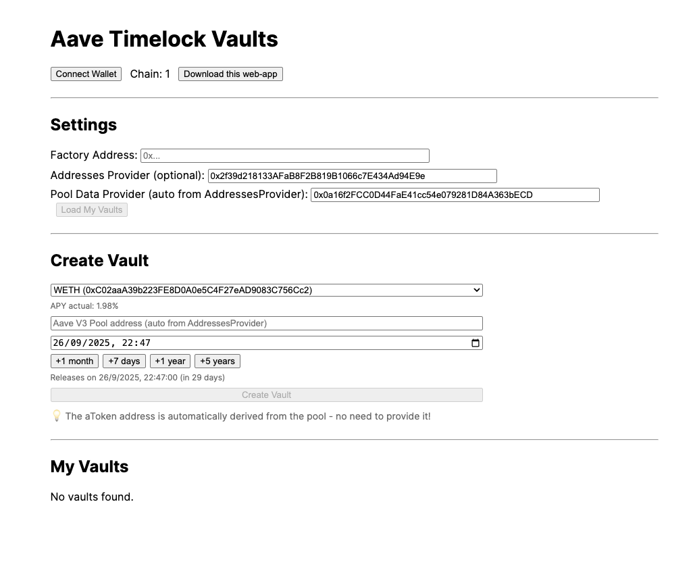

# Aave Vault DApp

A minimal, client-only savings dApp with hard timelock vaults depositing into Aave V3. Create multiple independent vaults, deposit an ERC20 asset, accrue Aave yield, and prevent withdrawals until a chosen release time.

## Features
- Timelock vaults that deposit into Aave V3 and block withdrawals until `releaseTime`.
- Extend-only lock (can only increase `releaseTime`).
- Factory to create and index user vaults on-chain.
- Client-only React app (Vite) to create vaults, deposit, and withdraw (after time).
- **Desktop Electron app** with custom icon for native desktop experience.
- No admin backdoors in vaults; non-upgradeable, immutable owner.
- **Automatic aToken detection** - no need to manually provide aToken addresses!
 
Test it here: https://pabloes.github.io/aave-vault-dapp/



## Monorepo Layout
- `contracts/` — Hardhat project with Solidity contracts and deploy scripts
- `frontend/` — Vite + React app
- `desktop/` — Electron desktop application

---

## 1) Contracts

### Prerequisites
- Node.js LTS
- pnpm (recommended) or npm

### Install
```bash
cd contracts
pnpm install
# or: npm install
```

### Configure Networks (optional)
Copy `.env.example` to `.env` and populate keys as needed.
```bash
cp .env.example .env
```

Supported networks are configured via Hardhat. You can add your RPCs and accounts in `.env`.

### Compile
```bash
pnpm hardhat compile
```

### Deploy Factory
Deploys only the `VaultFactory` contract. Vaults are created by calling the factory at runtime.
```bash
# Example: deploy to a given network
pnpm hardhat run scripts/deployFactory.ts --network <network>
```
Output will include the deployed `VaultFactory` address. Save it for the frontend.

### Contracts Overview
- `TimelockAaveVault.sol`
  - Owner is set at construction and immutable.
  - Stores `asset` (underlying), `pool` (Aave V3 Pool), `aToken` (corresponding aToken), and `releaseTime`.
  - `deposit(amount)`: pulls tokens from owner, approves Pool, and supplies to Aave.
  - `withdraw(amount,to)` and `withdrawAll(to)`: only after `releaseTime`.
  - `extendLock(newReleaseTime)`: only increases the lock.
  - `maxWithdrawable()`: current aToken balance for the vault (indicative of underlying + yield).
- `VaultFactory.sol`
  - `createVault(asset, pool, releaseTime)`; automatically derives aToken from pool and indexes vault by owner.
  - `getVaultsByOwner(owner)` to enumerate without a backend.

Note: The factory automatically calls `pool.getReserveData(asset)` to get the correct aToken address, so you only need to provide the asset and pool addresses.

---

## 2) Frontend

### Install
```bash
cd frontend
pnpm install
# or: npm install
```

### Run Dev Server
```bash
pnpm dev
```
The app runs on `http://localhost:5173` by default.

### Build Static Site
```bash
pnpm build
pnpm preview
```

### Using the App
1. Connect wallet (uses the browser's injected provider, e.g., MetaMask).
2. Set the `VaultFactory` address for the current network in the Settings panel.
3. Create a new vault by providing:
   - Token (underlying ERC20) address
   - Aave Pool address (for the selected network)
   - Release time (future datetime)
4. Your vaults will appear under "My Vaults" by reading the on-chain index from the factory.
5. For each vault:
   - Approve the vault to spend your underlying token
   - Deposit an amount (supplies to Aave)
   - After the countdown reaches zero, withdraw a partial amount or withdraw all

### Notes
- **aToken addresses are automatically detected** from the Aave Pool - no manual input required!
- The dApp reads the aToken balance as your accrued amount (principal + interest) at Aave.
- You can switch networks in your wallet; the app will adapt. Provide a factory address per network.

---

## 3) Desktop App

### Install
```bash
cd desktop
npm install
```

### Development
```bash
npm run dev
```

### Build Desktop App
```bash
npm run build        # Build for all platforms
npm run build:mac    # macOS only
npm run build:win    # Windows only
npm run build:linux  # Linux only
```

### Custom Icon Generation
```bash
npm run generate-icons
```

### Features
- **Native desktop experience** with Electron
- **Custom icon** with hand holding padlock design
- **Multi-platform support** (macOS, Windows, Linux)
- **Integrated web interface** - same as the web version
- **Secure configuration** with context isolation

---

## Addresses You Need (per network)
- Aave V3 Pool address for your network
- Deployed `VaultFactory` address (from your own deployment)

**That's it!** The aToken address is automatically derived from the pool.

Consult Aave docs and explorers to find official addresses. Example resources: Aave docs for network deployments and token lists.

---

## Security Considerations
- No admin backdoors in vaults; only the owner can act, and only within the rules.
- Vaults are not upgradeable. Review code before deploying.
- Always double-check the Aave Pool address you provide.
- The factory validates that the asset is supported by the pool before creating a vault.
- Desktop app uses secure Electron configuration with `nodeIntegration: false`.

---

## License
MIT

